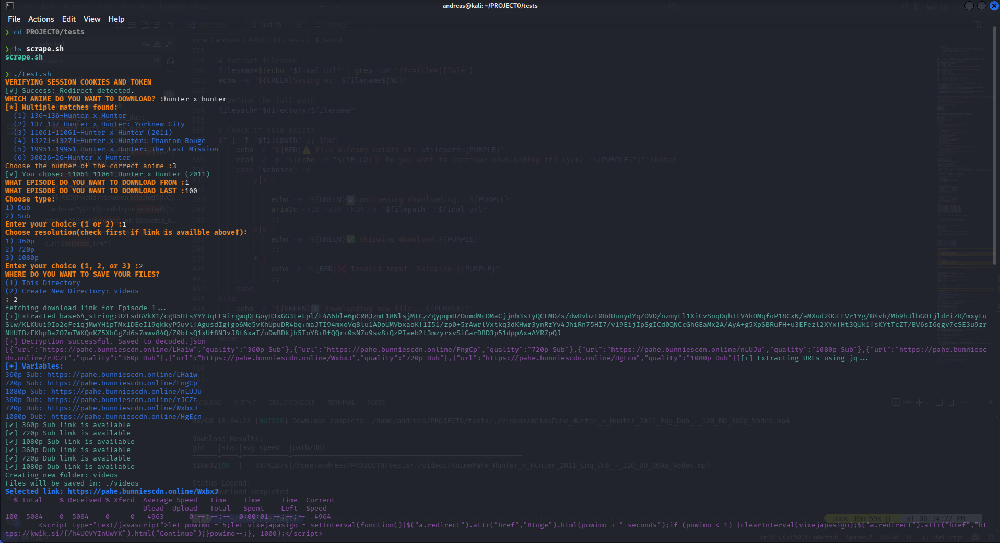

<h1 align="center">🎥 Aniwave Kwik Downloader</h1>

<p align="center">
  <b>Automated Anime Episode Downloader from Aniwave with kwik.si Bypass</b><br>
  <sub>Verify & refresh kwik.si tokens automatically, extract direct download links, and save your time.</sub>
</p>

---

## 📖 About

**Aniwave Kwik Downloader** is a Bash + Python automation tool that:
- **Verifies** your kwik.si session cookies & tokens.
- **Refreshes** expired ones automatically using Selenium.
- **Extracts** direct download URLs from protected pages.
- **Downloads** your anime episodes without manual browser steps.

Whether you're binge-watching a series or archiving your favorites, this tool handles the annoying verification step so you can focus on the watching, not the waiting.

---

## ✨ Features

✅ Automatic kwik.si verification  
✅ Headless browser token renewal  
✅ Direct download link extraction  
✅ Color-coded terminal output  
✅ Easy to run — no coding needed  

---

## 📂 Project Structure

aniwave-kwik-downloader/
│
├── test.sh # Main script
├── session.env # Stores kwik.si session & token
└── README.md # This file


---

## 📦 Requirements

**System:**
- Bash
- curl, grep
- Python 3.8+
- Google Chrome **or** Chromium

**Python Packages:**
- Bash
- pip3, selenium, chromedriver-autoinstaller, webdriver-manager`

⚙️ Setup Procedure (First-Time Installation)

Follow these steps to set up on Ubuntu / Kali / Debian systems.

1️⃣ Install system dependencies
-Bash
`sudo apt update && sudo apt install bash curl grep python3 python3-pip chromium -y`
GOOGLE-CHROME
#Download
`wget https://storage.googleapis.com/chrome-for-testing-public/139.0.7258.66/linux64/chrome-linux64.zip`
#Unzip
`unzip chrome-linux64.zip`
#Move Chrome folder to /opt
`sudo mv chrome-linux64 /opt/google-chrome`

#Make sure it's executable
`sudo chmod +x /opt/google-chrome/chrome`

#Create a symlink so 'google-chrome' works globally
`sudo ln -sf /opt/google-chrome/chrome /usr/bin/google-chrome`
CHROME-WEBDRIVER
#Download
`wget https://storage.googleapis.com/chrome-for-testing-public/139.0.7258.66/linux64/chromedriver-linux64.zip`
#Unzip chromedriver-linux64.zip
`unzip chromedriver-linux64.zip`
#move /usr/local/bin
`sudo mv chromedriver-linux64/chromedriver /usr/local/bin/chromedriver`
#Make it executable
`sudo chmod +x /usr/local/bin/chromedriver`


2️⃣ Install required Python packages

`pip3 install selenium chromedriver-autoinstaller webdriver-manager --break-system-packages`
If you get this warning
WARNING: The script chromedriver-path is installed in '/home/andreas/.local/bin' which is not on PATH.
  Consider adding this directory to PATH or, if you prefer to suppress this warning, use --no-warn-script-location.
Run 
For Bash:
`echo 'export PATH="$PATH:/home/andreas/.local/bin"' >> ~/.bashrc
source ~/.bashrc`
For Zsh:
`echo 'export PATH="$PATH:/home/andreas/.local/bin"' >> ~/.zshrc
source ~/.zshrc
`

3️⃣ Download the repository

`git clone https://github.com/Andreaz254/anime-downloader-and-scraper.git`
`cd anime-downloader-and-scraper`

5️⃣ Make the script executable

`chmod +x downloader.sh`

6️⃣ Run the script

./downloader.sh


📸 Screenshot
<p align="center">
  
</p>

🛠 Troubleshooting
Issue	Solution
chromedriver not found	Install chromedriver-autoinstaller or manually download matching driver version.
Token/session expired too quickly	Re-run script to refresh automatically.
No Chrome installed	Install Chrome or Chromium and make sure it's in PATH.
📝 License

This project is licensed under the MIT License — feel free to use and modify.

 <p align="center"> Made with ❤️ by anime lovers, for anime lovers. </p> ``` 

